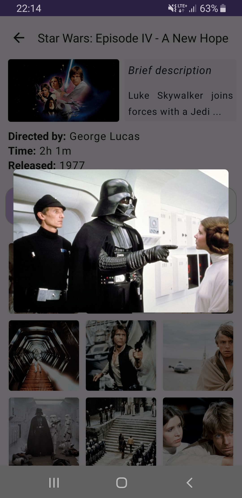

# Movies app

- [Version 1](#version-1)
- [Version 2 (Version 1 + ExoPlayer with trailers)](#version-2)

> [!NOTE]
> If you would like to build and run the application in the *release* mode then you need to add those four lines to your `local.properties` file:
> > RELEASE_STORE_FILE=\<your path to the *.jks file>  
> > RELEASE_STORE_PASSWORD=\<your password>  
> > RELEASE_KEY_ALIAS=\<your alias>  
> > RELEASE_KEY_PASSWORD=\<your password>  

## :ballot_box_with_check: Version 2
### Description
The second version of the app was supposed to be an extended version of the application created previously (in the first version). New requirements:
- app must allow the user to play at least 1-minute video for at least 3 items from the list of the movies,
- provided player must provide some controlls to switch between the videos, play/pause the video and stop it poperly.

## Demo
Screenshots presented below shows the basic usage of the extended application.  

  
  
  

  
  
  

## Implementation details
In this section are described only those elements that were added or were changed in compare to the [Version 1](#version-1).

`MainViewModel` is a *HiltViewModel* that uses a *SavedStateHandle* and an *ExoPlayer* injection to the constructor. It stores four variables via *SavedStateHandle* that are needed to persist during some configuration changes (like a screen rotation). During its initialization `MainViewModel` loads the data from a simulated database to be able to preprocess it and provide it in a convenient way for other functions.

`MoviePlayerModule` creates a *Hilt module* that provides an *ExoPlayer* dependency scoped to *ViewModels*. When a *ViewModel* annotated with *@HiltViewModel* requests an *ExoPlayer* dependency, *Hilt* uses this module to create a new *ExoPlayer*.

`MainScreen` defines the layout of the app's main screen. It uses a *TabRow* and *HorizontalPager* to create two swipeable tabs: one called *Details* with the list of the movies (to keep the functionality from the [Version 1](#version-1)) and one called *Trailers* to handle extended functionality of plaing some videos related to the movies.

## :ballot_box_with_check: Version 1

### Introduction
This app was created for the Mobile Applications course. Main features that were required to be implemented:
- app must be based on the Jetpack Compose,
- on the main screen should be presented a list of at least 3 movies (cards with some image presenting the movie + title),
- on the other screen should be presented the details about every movie,
- details screen should be opened after user clicks on the selected movie card from the list,
- details should include: main image, some kind of a description about the movie, grid (3x3 or 4x4) of the images from the movie and a list of actors/actresses.

## Demo
Here are some screenshots presenting the basic usage of the app.  

  
  
  

  
  
  

## Implementation details
This application uses Jetpack Compose features and is based on the MVVM architectural pattern.

`ContentManager` is a simulated API providing convenient access to data from the database. In this app a real database is not used - all the needed resources are stored in the `res` directory (`drawable` folder or `strings.xml`).
  
`MainActivity` has a reference to the `MainViewModel` which is responsible for:
- communicating with a dummy database via simulated `ContentManager` API,
- providing processed data for the screens to be displayed.

`MainActivity`:
- defines routes for the navController to enable screen switching
- passes data to be displayed on each screen by calling proper function from the `MainViewModel`.

`MainScreen` defines the layout of the app's main screen. It uses a *Scaffold* and a *LazyColumn* [Jetpack componets] to achieve the functionality of the movies list with cards.

`DetailsScreen` defines the layout to present details about a movie. It uses:
- *Scaffold* with *TopAppBar* to create a top bar with an arrow allowing to come back to the main screen,
- *Column* and *verticalScroll(rememberScrollState())* to enable scrolling the screen when needed. Because of that - LazyGrid could not be used (it cannot be inside a component with enabled *verticalScroll*), so a custom *NonLazyGrid* was implemented to behave like a default one,
- *remember* function to control the *mutableStatesOf* which defines whether a specific dialog should be displayed.

`MovieDetails` is a data class used to conveniently store all the data about each movie.

`rememberWindowInfo()` is a function used to get information about the current device's screen configuration.
